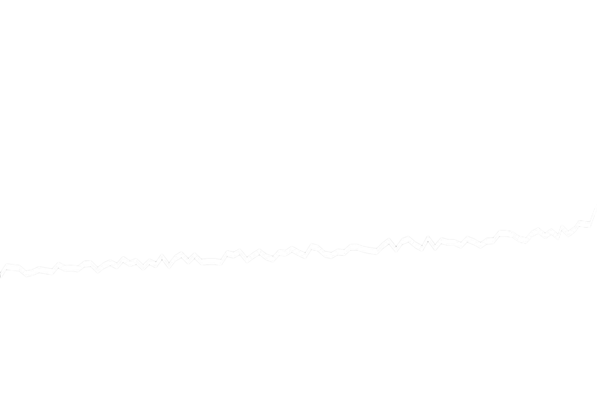

<h1 align=center>𝙰𝚑𝚘𝚢, 𝚖𝚊𝚝𝚎𝚢</h1>

𝙸 𝚊𝚖 **𝙽𝚒𝚔𝚑𝚒𝚕**, 𝚊 𝚍𝚎𝚍𝚒𝚌𝚊𝚝𝚎𝚍 **𝚠𝚎𝚋 𝚍𝚎𝚟𝚎𝚕𝚘𝚙𝚎𝚛** 𝚊𝚗𝚍 **𝚌𝚘𝚖𝚙𝚞𝚝𝚎𝚛 𝚜𝚌𝚒𝚎𝚗𝚌𝚎 𝚎𝚗𝚝𝚑𝚞𝚜𝚒𝚊𝚜𝚝** 𝚗𝚊𝚟𝚒𝚐𝚊𝚝𝚒𝚗𝚐 𝚝𝚑𝚎 𝚍𝚢𝚗𝚊𝚖𝚒𝚌 𝚜𝚎𝚊𝚜 𝚘𝚏 𝚌𝚘𝚍𝚎! 🌊 

𝚆𝚒𝚝𝚑 𝚊 𝚜𝚝𝚛𝚘𝚗𝚐 𝚏𝚘𝚌𝚞𝚜 𝚘𝚗 𝚝𝚑𝚎 **𝙼𝙴𝚁𝙽 𝚜𝚝𝚊𝚌𝚔**, 𝙸’𝚖 𝚙𝚊𝚜𝚜𝚒𝚘𝚗𝚊𝚝𝚎 𝚊𝚋𝚘𝚞𝚝 𝚌𝚛𝚎𝚊𝚝𝚒𝚗𝚐 𝚒𝚗𝚗𝚘𝚟𝚊𝚝𝚒𝚟𝚎 𝚍𝚒𝚐𝚒𝚝𝚊𝚕 𝚜𝚘𝚕𝚞𝚝𝚒𝚘𝚗𝚜 𝚝𝚑𝚊𝚝 𝚝𝚛𝚊𝚗𝚜𝚏𝚘𝚛𝚖 𝚒𝚍𝚎𝚊𝚜 𝚒𝚗𝚝𝚘 𝚒𝚖𝚙𝚊𝚌𝚝𝚏𝚞𝚕 𝚠𝚎𝚋 𝚊𝚙𝚙𝚕𝚒𝚌𝚊𝚝𝚒𝚘𝚗𝚜. 💻  

𝙵𝚛𝚘𝚖 𝚍𝚎𝚜𝚒𝚐𝚗𝚒𝚗𝚐 𝚛𝚎𝚜𝚙𝚘𝚗𝚜𝚒𝚟𝚎 𝚒𝚗𝚝𝚎𝚛𝚏𝚊𝚌𝚎𝚜 𝚝𝚘 𝚘𝚙𝚝𝚒𝚖𝚒𝚣𝚒𝚗𝚐 𝚍𝚊𝚝𝚊𝚋𝚊𝚜𝚎𝚜, 𝙸 𝚝𝚊𝚌𝚔𝚕𝚎 𝚎𝚟𝚎𝚛𝚢 𝚌𝚑𝚊𝚕𝚕𝚎𝚗𝚐𝚎 𝚠𝚒𝚝𝚑 𝚎𝚗𝚝𝚑𝚞𝚜𝚒𝚊𝚜𝚖 𝚊𝚗𝚍 𝚊 𝚌𝚘𝚖𝚖𝚒𝚝𝚖𝚎𝚗𝚝 𝚝𝚘 𝚎𝚡𝚌𝚎𝚕𝚕𝚎𝚗𝚌𝚎. 𝙼𝚢 𝚖𝚒𝚜𝚜𝚒𝚘𝚗 𝚒𝚜 𝚝𝚘 𝚋𝚞𝚒𝚕𝚍 𝚎𝚡𝚌𝚎𝚙𝚝𝚒𝚘𝚗𝚊𝚕 𝚠𝚎𝚋 𝚎𝚡𝚙𝚎𝚛𝚒𝚎𝚗𝚌𝚎𝚜 𝚝𝚑𝚊𝚝 𝚗𝚘𝚝 𝚘𝚗𝚕𝚢 𝚖𝚎𝚎𝚝 𝚌𝚕𝚒𝚎𝚗𝚝 𝚗𝚎𝚎𝚍𝚜 𝚋𝚞𝚝 𝚊𝚕𝚜𝚘 𝚙𝚛𝚘𝚟𝚒𝚍𝚎 𝚍𝚎𝚕𝚒𝚐𝚑𝚝𝚏𝚞𝚕 𝚒𝚗𝚝𝚎𝚛𝚊𝚌𝚝𝚒𝚘𝚗𝚜 𝚏𝚘𝚛 𝚞𝚜𝚎𝚛𝚜. ✨  

𝙹𝚘𝚒𝚗 𝚖𝚎 𝚘𝚗 𝚝𝚑𝚒𝚜 𝚝𝚑𝚛𝚒𝚕𝚕𝚒𝚗𝚐 𝚓𝚘𝚞𝚛𝚗𝚎𝚢 𝚘𝚏 𝚝𝚎𝚌𝚑𝚗𝚘𝚕𝚘𝚐𝚢 𝚊𝚗𝚍 𝚌𝚛𝚎𝚊𝚝𝚒𝚟𝚒𝚝𝚢 𝚊𝚜 𝚠𝚎 𝚎𝚡𝚙𝚕𝚘𝚛𝚎 𝚗𝚎𝚠 𝚑𝚘𝚛𝚒𝚣𝚘𝚗𝚜 𝚝𝚘𝚐𝚎𝚝𝚑𝚎𝚛! 🚀

</img>

- 🔭 **𝙲𝚞𝚛𝚛𝚎𝚗𝚝𝚕𝚢 𝚗𝚊𝚟𝚒𝚐𝚊𝚝𝚒𝚗𝚐** 𝚊 𝚏𝚕𝚎𝚎𝚝 𝚘𝚏 𝚎𝚡𝚌𝚒𝚝𝚒𝚗𝚐 𝚙𝚛𝚘𝚓𝚎𝚌𝚝𝚜 𝚊𝚗𝚍 𝚜𝚎𝚎𝚔𝚒𝚗𝚐 𝚖𝚢 𝚗𝚎𝚡𝚝 𝚐𝚛𝚊𝚗𝚍 𝚊𝚍𝚟𝚎𝚗𝚝𝚞𝚛𝚎!
- 🌱 **𝙳𝚒𝚟𝚒𝚗𝚐 𝚍𝚎𝚎𝚙 𝚒𝚗𝚝𝚘** **𝙵𝚞𝚕𝚕 𝚂𝚝𝚊𝚌𝚔 𝙳𝚎𝚟𝚎𝚕𝚘𝚙𝚖𝚎𝚗𝚝**, 𝚖𝚊𝚜𝚝𝚎𝚛𝚒𝚗𝚐 𝚝𝚑𝚎 𝚜𝚎𝚌𝚛𝚎𝚝𝚜 𝚘𝚏 𝚝𝚑𝚎 𝚍𝚒𝚐𝚒𝚝𝚊𝚕 𝚜𝚎𝚊𝚜.
- 👯 **𝙻𝚘𝚘𝚔𝚒𝚗𝚐 𝚏𝚘𝚛 𝚏𝚎𝚕𝚕𝚘𝚠 𝚍𝚎𝚟𝚎𝚕𝚘𝚙𝚎𝚛𝚜** 𝚝𝚘 𝚌𝚘𝚕𝚕𝚊𝚋𝚘𝚛𝚊𝚝𝚎 𝚘𝚗 **𝚘𝚙𝚎𝚗-𝚜𝚘𝚞𝚛𝚌𝚎 𝚚𝚞𝚎𝚜𝚝𝚜** 𝚊𝚗𝚍 𝚌𝚘𝚍𝚎-𝚏𝚒𝚕𝚕𝚎𝚍 𝚟𝚘𝚢𝚊𝚐𝚎𝚜.
- 💬 **𝙶𝚘𝚝 𝚝𝚎𝚌𝚑 𝚝𝚛𝚘𝚞𝚋𝚕𝚎𝚜 𝚘𝚛 𝚌𝚘𝚍𝚒𝚗𝚐 𝚌𝚞𝚛𝚒𝚘𝚜𝚒𝚝𝚒𝚎𝚜?** 𝚂𝚑𝚘𝚘𝚝 𝚖𝚎 𝚊 𝚖𝚎𝚜𝚜𝚊𝚐𝚎, 𝚊𝚗𝚍 𝙸'𝚕𝚕 𝚋𝚎 𝚑𝚊𝚙𝚙𝚢 𝚝𝚘 𝚑𝚎𝚕𝚙!
- 📫 **𝚁𝚎𝚊𝚌𝚑 𝚘𝚞𝚝** 𝚋𝚢 𝚜𝚎𝚗𝚍𝚒𝚗𝚐 𝚊 𝚖𝚎𝚜𝚜𝚊𝚐𝚎 𝚒𝚗 𝚊 𝚋𝚘𝚝𝚝𝚕𝚎 (𝚘𝚛 𝚎𝚖𝚊𝚒𝚕 𝚖𝚎 𝚊𝚝 [25𝚗𝚒𝚔𝚖𝚎𝚑𝚝𝚊@𝚐𝚖𝚊𝚒𝚕.𝚌𝚘𝚖](mailto:25nikmehta@gmail.com)).

<h2 align="center">𝚃𝚎𝚌𝚑 𝙸 𝚞𝚜𝚎</h2>

<h3 align="center">Languages</h3>

</img>
</img>
</img>
</img>
</img>

<h3 align="center">Web Development</h3>

</img>
</img>
</img>
</img>
</img>
</img>
</img>
</img>
</img>
</img>
</img>

<h3 align="center">Tools</h3>

</img>
</img>
</img>
</img> l
</img>

<h3 align="center">Design</h3>

  </img>
</img>

<h3 align="center">More</h3>

</img>
</img>
</img>
</img>
</img>

<h2 align="center">𝚂𝚝𝚊𝚝𝚜</h2>

  

</img>

</img>

</img>

𝚂𝚑𝚘𝚠 𝚜𝚘𝚖𝚎 ♡ 𝚋𝚢 𝚜𝚝𝚊𝚛𝚒𝚗’ 𝚖𝚢 𝚛𝚎𝚙𝚘𝚜𝚒𝚝𝚘𝚛𝚒𝚎𝚜 𝚊𝚗𝚍 𝚓𝚘𝚒𝚗𝚒𝚗’ 𝚝𝚑𝚎 𝚝𝚛𝚎𝚊𝚜𝚞𝚛𝚎 𝚑𝚞𝚗𝚝!

  

